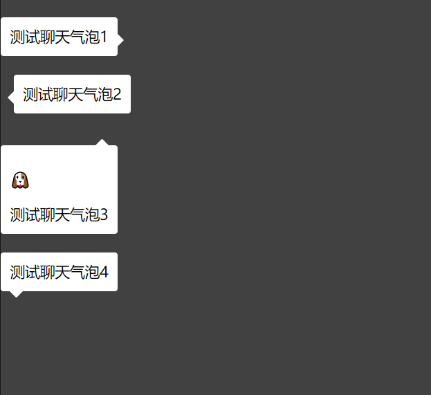

## 聊天气泡


## 使用示例
```ts
import { pop } from "./chat.bubble"

pop(document.querySelector("#container-right"),  {
    content: "测试聊天气泡1",
    sharpAngleMarginEnd: 10,
    position: "east",
})

pop(document.querySelector("#container-left"),  {
    content: "测试聊天气泡2",
    sharpAngleMarginEnd: 10,
    position: "west",
})

pop(document.querySelector("#container-top"),  {
    content: "测试聊天气泡3",
    sharpAngleMarginEnd: 10,
    position: "north",
})

pop(document.querySelector("#container-bottom"),  {
    content: "测试聊天气泡4",
    sharpAngleMarginStart: 10,
    position: "south",
})
```